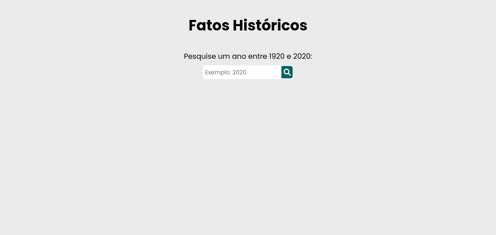

<h1 align="center"> Fatos históricos </h1>

<br>

<p align="center">
  <a href="#-tecnologias">Tecnologias</a>&nbsp;&nbsp;&nbsp;|&nbsp;&nbsp;&nbsp;
  <a href="#-projeto">Projeto</a>
</p>

<br>

<p align="center">
  
</p>

## Tecnologias

Esse projeto foi desenvolvido com as seguintes tecnologias:

- [React.js](https://github.com/facebook/react)
- [Typescript](https://www.typescriptlang.org/)
- [Zustand](https://github.com/pmndrs/zustand)

## Projeto

Esse projeto é o Front-end da aplicação Fatos Históricos, onde o usuário informa um ano entre 1920 e 2020 e obterá como retorno um fato histórico referente ao ano informado.

## Como Executar

1. Clone o repositório e acesse a pasta do projeto

   ```shell
   git clone https://github.com/Santana-Victor/fatos-historicos.git
   cd nome-do-repositorio
   ```

2. Instale os pacotes utilizando o comando `npm install`

3. Vá até o arquivo `.env.example` na raiz do projeto e renome-o para `.env`

4. Ainda no arquivo `.env` preencha a variável `VITE_URL_API`, por exemplo: `http://localhost:8080/facts`

5. Execute o projeto com o comando `npm run dev`

- [Acesse o projeto finalizado, online](https://fatos-historicos-nu.vercel.app/)
- [Repositório da API REST](https://github.com/Santana-Victor/api-fatos-historicos)
